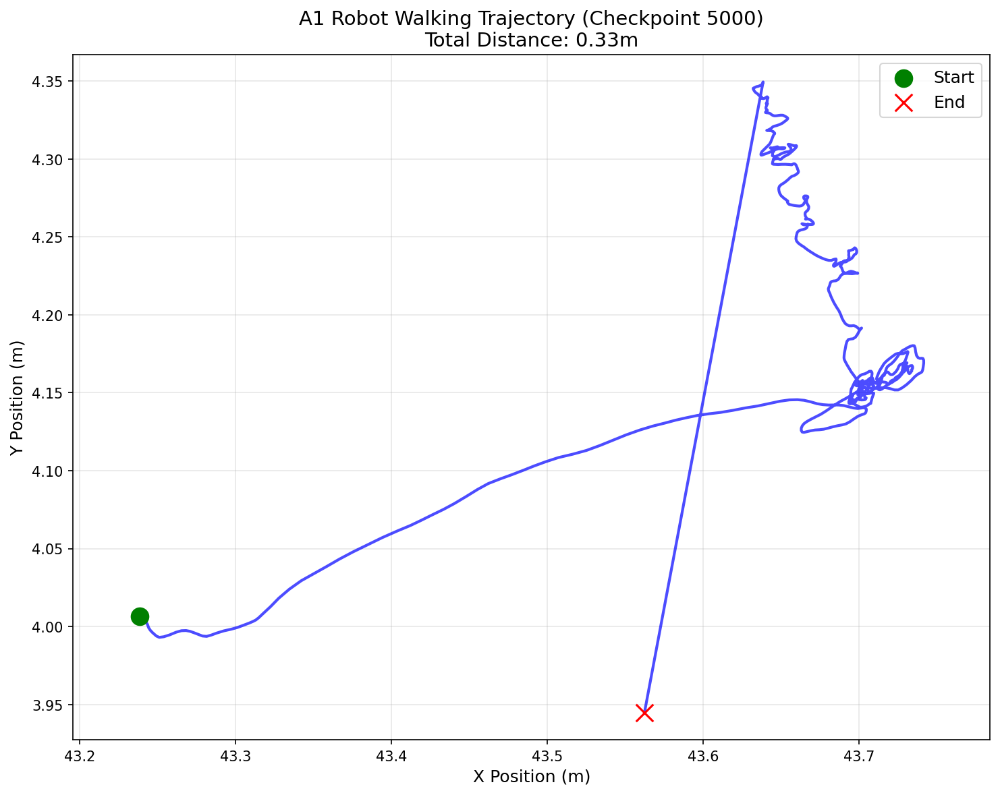

# Unitree A1 四足机器人强化学习训练项目

<p align="center">
  
</p>

<p align="center">
  <strong>基于 NVIDIA Isaac Gym + Legged Gym 的深度强化学习运动控制</strong>
</p>

<p align="center">
  <a href="#项目状态">项目状态</a> •
  <a href="#快速开始">快速开始</a> •
  <a href="#项目结构">项目结构</a> •
  <a href="#训练成果">训练成果</a> •
  <a href="#技术细节">技术细节</a>
</p>

---

## 项目信息

- **作者**: JX2589088
- **项目类型**: 四足机器人深度强化学习控制
- **开发时间**: 2026年4月
- **算法**: PPO (Proximal Policy Optimization)
- **仿真平台**: NVIDIA Isaac Gym Preview 4

## 项目状态

| 状态 | 描述 |
|------|------|
| ✅ **训练完成** | 5000 轮迭代，约2小时 (RTX 2080 Ti) |
| ✅ **模型可用** | 可在复杂地形稳定行走 900+ 步 |
| ✅ **多环境演示** | 支持同时展示 64 条狗 |
| ✅ **地形适应** | 支持斜坡、楼梯、离散地形等 |

## 快速开始

### 环境要求

- Ubuntu 20.04/22.04
- NVIDIA GPU (6GB+ 显存)
- CUDA 11.7
- Python 3.8

### 获取依赖仓库

本项目依赖以下三个官方仓库，需要单独克隆：

```bash
# 克隆 Isaac Gym (NVIDIA 官方)
git clone https://github.com/NVIDIA-Omniverse/IsaacGymEnvs.git isaacgym

# 克隆 Legged Gym (ETH Zurich)
git clone https://github.com/leggedrobotics/legged_gym.git

# 克隆 RSL-RL (ETH Zurich)
git clone https://github.com/leggedrobotics/rsl_rl.git
```

### 安装步骤

```bash
# 1. 创建 conda 环境
conda create -n a1_robot python=3.8 -y
conda activate a1_robot

# 2. 安装 PyTorch (CUDA 11.7)
pip install torch==1.13.1+cu117 torchvision==0.14.1+cu117 --extra-index-url https://download.pytorch.org/whl/cu117
pip install tensorboard matplotlib "numpy<1.24"

# 3. 安装 Isaac Gym
cd isaacgym/python && pip install -e . && cd ..

# 4. 安装 Legged Gym
cd ../legged_gym && pip install -e . && cd ..

# 5. 安装 RSL-RL
cd ../rsl_rl && pip install -e . && cd ..
```

### 训练

```bash
# GPU 训练 (推荐)
python scripts/train_a1_v2.py --headless --max_iterations=5000

# 恢复训练
python scripts/train_a1_v2.py --headless --resume
```

### 演示运行

```bash
# 设置环境变量
export LD_LIBRARY_PATH=$CONDA_PREFIX/lib:$LD_LIBRARY_PATH
cd scripts

# 多环境演示 (默认4条狗)
python play_demo_v2.py --checkpoint=5000

# 64条狗大规模展示
python play_demo_many.py

# 慢动作步态分析
python play_slow_motion.py

# 地形挑战测试
python play_terrain_challenge.py

# 训练前后对比
python play_compare_checkpoints.py

# 交互式演示
python play_demo_interactive.py

# 高清GIF录制
python record_hd_demo.py
```

### 可视化训练结果

```bash
# 启动 TensorBoard
tensorboard --logdir=legged_gym/logs/a1_custom_v2

# 绘制训练曲线
python scripts/plot_training.py
```

## 项目结构

```
.
├── configs/                      # 配置文件
│   ├── a1_custom_config.py       # 基础配置
│   └── a1_custom_config_v2.py    # V2优化配置（推荐）
├── scripts/                      # 可执行脚本
│   ├── train_a1_v2.py           # 主训练脚本
│   ├── play_demo_v2.py          # 多环境演示
│   ├── play_demo_many.py        # 64条狗展示
│   ├── play_slow_motion.py      # 慢动作分析
│   ├── play_terrain_challenge.py # 地形挑战
│   ├── play_compare_checkpoints.py # 训练对比
│   ├── record_hd_demo.py        # GIF录制
│   └── plot_training.py         # 训练可视化
├── videos/                       # 演示视频和图表
│   ├── a1_walking_demo_5000iters.gif
│   └── figures/                  # TensorBoard导出图表
├── legged_gym/                   # Legged Gym训练框架 (外部依赖)
├── rsl_rl/                       # RSL-RL算法库 (外部依赖)
├── isaacgym/                     # Isaac Gym物理引擎 (外部依赖)
├── 技术报告.md                    # 详细技术文档 (~12000字)
├── requirements.txt              # Python依赖
├── run.sh                        # 训练启动脚本
└── README.md                     # 本文件
```

> **注意**: `legged_gym/`, `rsl_rl/`, `isaacgym/` 为外部依赖，不包含在本仓库中。请按照[获取依赖仓库](#获取依赖仓库)部分的说明自行克隆。

## 训练成果

### 性能指标

| 指标 | 数值 |
|------|------|
| 训练轮数 | 5000 iterations |
| 并行环境数 | 2048 |
| 网络结构 | Actor-Critic [512, 256, 128] |
| 激活函数 | ELU |
| 学习率 | 5e-4 (自适应) |
| 折扣因子 γ | 0.99 |
| GAE参数 λ | 0.95 |
| 每轮步数 | 24步/环境 |
| 批次大小 | 49,152 (2048×24) |
| 训练时间 | ~2小时 (RTX 2080 Ti) |
| 地形课程 | 10级难度递进 |

### 模型位置

```
legged_gym/logs/a1_custom_v2/Mar31_23-07-49_/
├── model_5000.pt      # 最终模型
├── model_4900.pt      # 历史检查点
├── ...
├── model_100.pt
└── model_last.pt      # 最新模型（训练中断时使用）
```

## 技术细节

### 奖励函数设计

| 奖励项 | 权重 | 说明 |
|--------|------|------|
| tracking_lin_vel | 1.5 | 线速度跟踪 |
| tracking_ang_vel | 0.5 | 角速度跟踪 |
| feet_air_time | 2.0 | 步态奖励（鼓励对角线步态） |
| feet_contact_forces | -0.001 | 接触力惩罚 |
| torques | -0.0001 | 力矩惩罚（节能） |
| dof_vel | -0.0001 | 关节速度惩罚 |
| base_height | -1.0 | 高度保持 |
| upright | 0.1 | 姿态保持 |

### 地形配置

| 地形类型 | 比例 | 难度 |
|----------|------|------|
| 平地 | 15% | ⭐ |
| 粗糙坡地 | 15% | ⭐⭐ |
| 上坡楼梯 | 30% | ⭐⭐⭐ |
| 下坡楼梯 | 25% | ⭐⭐⭐ |
| 离散地形 | 15% | ⭐⭐⭐⭐ |

### 关键训练技巧

1. **课程学习 (Curriculum Learning)**: 地形难度从简单到复杂逐步增加
2. **领域随机化 (Domain Randomization)**: 摩擦系数、质量、质心位置随机化
3. **早停机制**: 监控KL散度防止策略更新过大
4. **熵正则化**: 保持探索，entropy_coef = 0.005

## 演示效果

### GIF 展示

<p align="center">
  
</p>

### 训练曲线

训练过程的 TensorBoard 曲线可在 `videos/figures/` 查看：

- `reward_curve.png` - 奖励曲线
- `episode_length.png` - 回合长度
- `value_loss.png` - 价值损失
- `policy_loss.png` - 策略损失
- `approx_kl.png` - KL散度
- `learning_rate.png` - 学习率变化
- `velocity_tracking.png` - 速度跟踪精度

## 文档

- [技术报告.md](技术报告.md) - 详细技术文档 (~12000字)，包含算法原理、网络架构、奖励设计、训练分析等
- [AGENTS.md](AGENTS.md) - 项目技术规范和开发指南

## 引用

本项目基于以下开源框架：

- [Isaac Gym](https://developer.nvidia.com/isaac-gym) - NVIDIA GPU加速物理仿真
- [Legged Gym](https://github.com/leggedrobotics/legged_gym) - ETH Zurich 四足机器人训练框架
- [RSL-RL](https://github.com/leggedrobotics/rsl_rl) - 鲁棒系统实验室RL库

## 许可证

本项目采用 MIT 许可证。详见 [LICENSE](LICENSE) 文件。

---

<p align="center">
  <strong>JX2589088</strong> • 2026年4月
</p>
