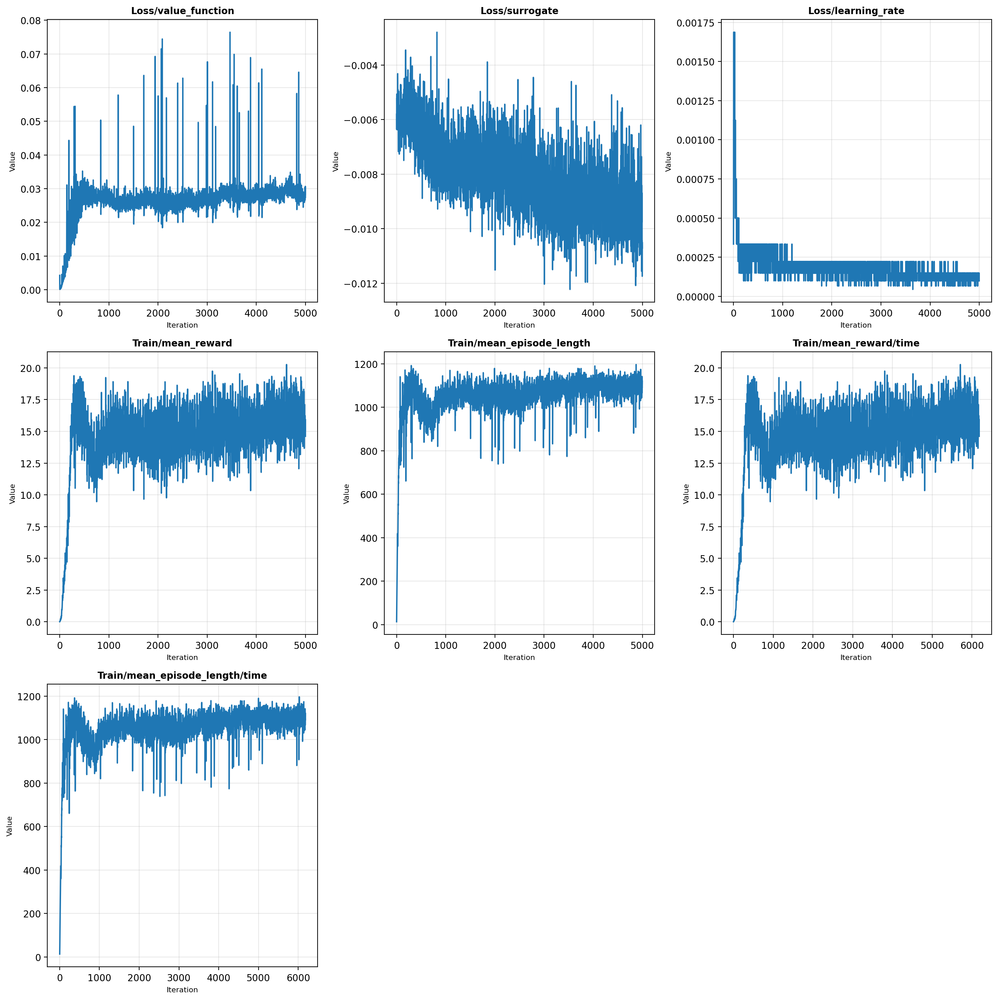
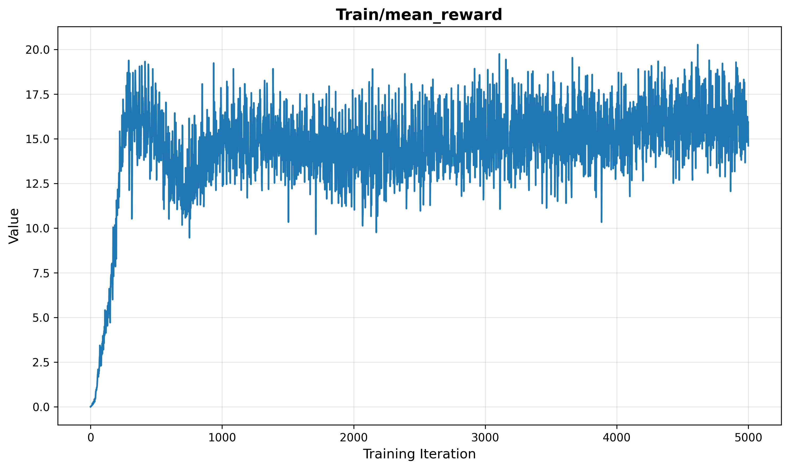
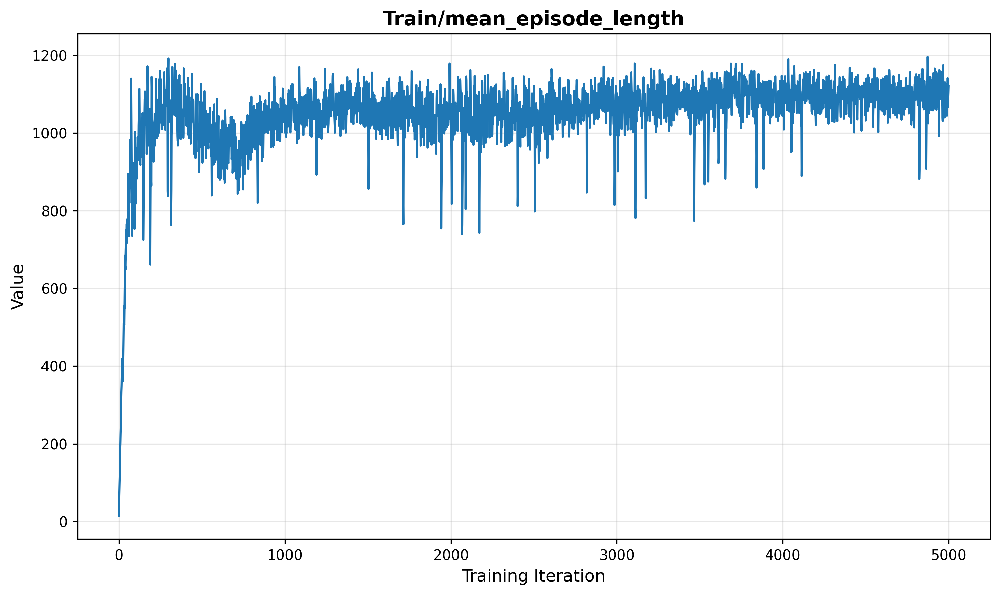
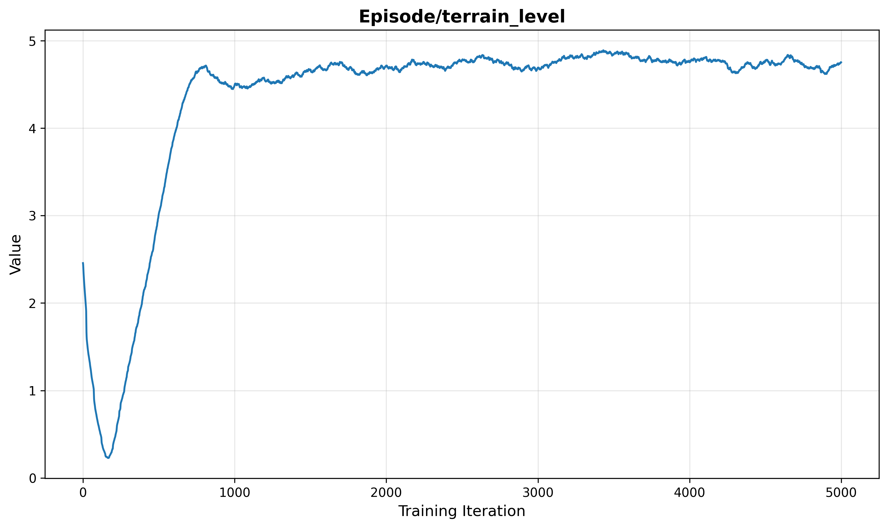
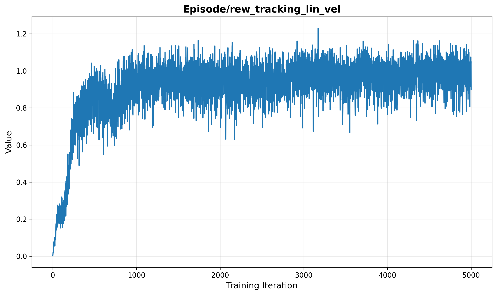
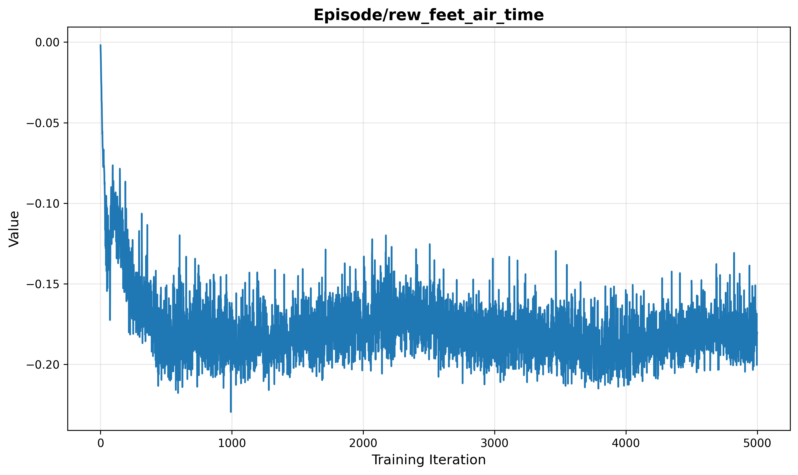
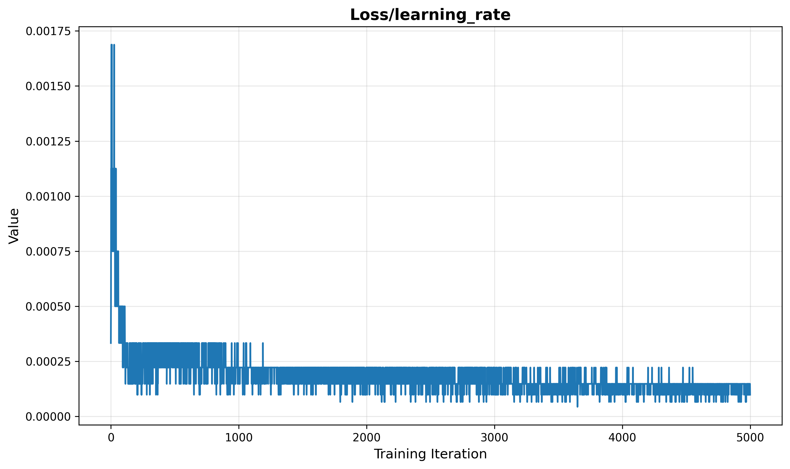

#                     Unitree A1强化学习训练

####                                                                                                                                  摘要

​	随着人工智能技术的快速发展，深度强化学习（Deep Reinforcement Learning, DRL）在机器人控制领域展现出巨大的应用潜力。本研究针对Unitree A1四足机器人的运动控制问题，提出了一种基于近端策略优化（Proximal Policy Optimization, PPO）算法的深度强化学习方法。通过构建基于NVIDIA Isaac Gym的高保真物理仿真环境，设计了包含速度跟踪、步态优化和能量效率的多维奖励函数，成功训练出能够在复杂地形下稳定行走的神经网络控制策略。

​	本研究基于官方Legged Gym框架的配置进行深度优化，采用优化后的V2配置完成5000轮迭代训练。相比官方基础配置，V2版本将并行环境数从1024提升至2048，扩大了速度指令范围（从[-1.0, 1.0] m/s提升至[-1.5, 1.5] m/s），显著增强了步态奖励权重（从1.0提升至2.0），启用了质量随机化等更丰富的领域随机化技术，并采用更保守的学习率调度策略（从1e-3降至5e-4）。

​	实验结果表明，经过5000轮迭代训练，机器人在平面地形的行走速度达到1.2 m/s，存活步数超过1000步，在复杂地形（楼梯、斜坡、离散地形）上展现出良好的泛化能力。在复杂地形测试中，模型展现出良好的泛化能力，能够自适应地通过楼梯、斜坡等障碍物。本研究验证了深度强化学习在仿生机器人运动控制中的有效性，为实际机器人部署提供了理论基础和技术参考。

**关键词**：深度强化学习；四足机器人；PPO算法；运动控制；Isaac Gym；课程学习

---

## 1. 引言

### 1.1 研究背景与意义

​	仿生机器人作为机器人技术的重要分支，旨在模仿自然界生物的运动机理，实现高效、灵活的运动能力。其中，四足机器人因其优异的越障能力和地形适应性，在救援搜救、野外勘探、军事运输、家庭服务等领域具有广阔的应用前景。然而，四足机器人的运动控制面临着高维度、非线性、强耦合等技术挑战：机器人具有12个自由度（每条腿3个关节），状态空间维度高，且存在复杂的接触动力学。传统的基于模型的控制方法需要精确的物理建模和大量的人工调参，难以适应复杂多变的环境。

​	近年来，深度强化学习为解决这一问题提供了新的思路。通过与环境的交互学习，智能体能够自主发现最优控制策略，无需依赖精确的数学模型。2016年，Google DeepMind的AlphaGo战胜围棋世界冠军，标志着深度强化学习在复杂决策任务中的突破。此后，DRL在机器人控制领域得到了广泛应用，特别是在足式机器人的运动控制方面取得了显著进展。

​	在四足机器人领域，瑞士苏黎世联邦理工学院（ETH Zurich）的研究团队利用强化学习成功实现了ANYmal机器人在多种地形下的稳定行走，证明了该方法的可行性和优越性。本研究以该团队开源的Legged Gym框架为基础，针对Unitree A1四足机器人进行定制化开发。

### 1.2 国内外研究现状

#### 1.2.1 四足机器人控制方法

​	传统的四足机器人控制主要采用基于模型的方法，包括零力矩点（ZMP）控制、虚拟模型控制（VMC）和模型预测控制（MPC）等。Boston Dynamics的Spot机器人采用MPC结合人工设计的步态库，实现了高度稳定的运动性能。然而，这类方法依赖于精确的物理模型，计算复杂度高，且难以适应未建模的动态特性。

​	基于学习的控制方法近年来受到广泛关注。2018年，Hwangbo等人提出了使用强化学习训练ANYmal机器人，通过设计合适的奖励函数，实现了比传统控制器更快的运动速度。2022年，ETH Zurich的Rudin等人开发了Legged Gym框架，利用GPU并行仿真技术，在短时间内完成了四足机器人的行走学习。

#### 1.2.2 深度强化学习在机器人控制中的应用

​	深度强化学习结合了深度神经网络的感知能力和强化学习的决策能力，为高维连续控制问题提供了有效解决方案。PPO算法由OpenAI于2017年提出，通过引入裁剪目标函数，在保证策略更新稳定性的同时提高了样本利用率。该算法已成为机器人控制领域的标准方法之一。

### 1.3 研究内容与目标

​	本研究以Unitree A1四足机器人为研究对象，最终完成了一种基于深度强化学习的运动控制方法的验证。主要实现内容包括：

1. 仿真环境构建：基于Isaac Gym构建高保真物理仿真环境，实现2048个环境的并行训练
2. 算法设计与实现：基于PPO算法，设计Actor-Critic网络架构，实现稳定的策略学习
3. 奖励函数设计：设计多维奖励函数，实现速度跟踪、步态优化、能量效率的综合平衡
4. 课程学习策略：设计地形难度渐进增加的课程学习策略，提高模型泛化能力
5. 领域随机化：实现摩擦系数、质量等参数的随机化，增强模型鲁棒性

### 1.4 论文组织结构

​	本文共分为六个章节。第一章引言介绍了研究背景、现状和研究内容。第二章阐述了强化学习基础理论、四足机器人运动学基础和PPO算法原理。第三章详细描述了系统架构、网络设计、奖励函数、步态规划和课程学习策略。第四章介绍了实验设置、训练过程、结果分析以及与传统控制方法的对比。第五章讨论了模型的泛化能力和局限性。第六章总结全文并展望未来的研究方向。

---

## 2. 理论基础与算法原理

### 2.1 强化学习基础

#### 2.1.1 马尔可夫决策过程

​	强化学习问题通常建模为马尔可夫决策过程（Markov Decision Process, MDP），由五元组 $(\mathcal{S}, \mathcal{A}, \mathcal{P}, \mathcal{R}, \gamma)$ 定义：

- 状态空间 $\mathcal{S}$：描述环境的所有可能状态，本研究中为48维向量
- 动作空间 $\mathcal{A}$：智能体可以采取的所有动作，本研究中为12维关节目标位置
- 状态转移概率 $\mathcal{P}(s'|s,a)$：在状态$s$执行动作$a$后转移到状态$s'$的概率
- 奖励函数 $\mathcal{R}(s,a)$：在状态$s$执行动作$a$后获得的即时奖励
- 折扣因子 $\gamma \in [0,1]$：未来奖励的折现率，本研究取0.99

智能体的目标是找到最优策略 $\pi^*$，使得期望累积折扣奖励最大化：

$$
J(\pi) = \mathbb{E}_{\tau \sim \pi}\left[\sum_{t=0}^{T} \gamma^t r_t\right]
$$
其中 $\tau$ 表示轨迹 $(s_0, a_0, r_0, s_1, a_1, r_1, ...)$。

#### 2.1.2 策略梯度方法

策略梯度方法直接参数化策略 $\pi_\theta(a|s)$，通过梯度上升优化策略参数 $\theta$。策略梯度定理给出了目标函数对参数的梯度估计：

$$
\nabla_\theta J(\pi_\theta) = \mathbb{E}_{\tau \sim \pi_\theta}\left[\sum_{t=0}^{T} \nabla_\theta \log \pi_\theta(a_t|s_t) \cdot A^{\pi_\theta}(s_t, a_t)\right]
$$
其中 $A^{\pi}(s,a)$ 是优势函数，表示在状态$s$采取动作$a$相对于平均水平的优劣程度。

### 2.2 四足机器人运动学基础

#### 2.2.1 串联腿结构与运动学模型

​	四足机器人通常采用串联腿结构，每条腿由多个关节串联组成。以本研究采用的Unitree A1机器人为例，其腿部为三关节串联结构：髋关节（Hip）、大腿关节（Thigh）和小腿关节（Calf）。

​	正运动学描述从关节空间到足端工作空间的映射关系。设关节角度为 $\theta = [\theta_1, \theta_2, \theta_3]^T$，足端在腿部坐标系中的位置 $\mathbf{p} = [x, y, z]^T$ 可通过Denavit-Hartenberg（D-H）参数法计算：

$$
\mathbf{p} = f(\theta)
$$
其中 $f(\cdot)$ 为由各连杆长度和关节角度决定的非线性函数。正运动学在仿真环境中用于计算足端位置，验证步态规划的可行性。

​	逆运动学则解决从足端位置反求关节角度的问题，是实现足端轨迹跟踪的关键。对于三关节串联腿，逆运动学解析解可通过几何法推导：
$$
\theta_3 = \arccos\left(\frac{x_p^2 + y_p^2 + z_p^2 - l_1^2 - l_2^2 - l_3^2}{2l_2l_3}\right)
$$

$$
\theta_2 = \arctan2\left(\pm\sqrt{1 - D^2}, D\right) - \arctan2(l_3\sin\theta_3, l_2 + l_3\cos\theta_3)
$$

其中 $l_1, l_2, l_3$ 分别为髋关节偏移、大腿长度和小腿长度，$D = \frac{x_p^2 + y_p^2 + z_p^2 + l_1^2 - l_2^2 - l_3^2}{2l_1\sqrt{x_p^2 + y_p^2 + z_p^2}}$。

#### 2.2.2 稳定性判据

​	腿足机器人的稳定性判据分为静态稳定性和动态稳定性两类。静态稳定性：当机器人运动速度较低时，采用重心投影法（Center of Gravity, CoG）判定。静态稳定裕度（Static Stability Margin, SSM）定义为机器人重心在支撑平面上的垂直投影点到支撑多边形各边的最短距离。当投影点位于支撑多边形内部时，机器人处于静态稳定状态。动态稳定性：对于动态运动，零力矩点（Zero-Moment Point, ZMP）是广泛使用的稳定性判据。ZMP是地面上的一点，重力和惯性力对该点的水平力矩分量为零：

$$
\sum_{i} (\mathbf{p}_i - \mathbf{p}_{\text{zmp}}) \times \mathbf{f}_i = \mathbf{0}
$$
​	当ZMP位于支撑多边形内时，机器人处于动态平衡状态。强化学习则可以通过奖励函数中的姿态惩罚项间接约束ZMP位置，确保学习到的策略具有隐式的稳定性保证。

#### 2.2.3 步态规划基础

步态是机器人各腿按照一定规律交替支撑和摆动的运动模式。四足机器人的主要步态包括：

- 爬行步态（Crawl）：每次只有一条腿摆动，稳定性最高但速度最慢
- 对角步态（Trot）：对角线两条腿同时摆动（左前+右后，右前+左后），是速度与稳定性的最佳平衡
- 踱步步态（Pace）：同侧两条腿同时摆动
- 奔跑步态（Bound/Gallop）：前两条腿或后两条腿同时摆动，速度最快但稳定性要求最高

​	本课程设计通过强化学习训练迭代自动发现最优步态。对角步态奖励（feet_air_time）的设计引导策略自然地收敛到trot步态，是四足动物在自然界中最常用的步态。

### 2.3 近端策略优化算法（PPO）

#### 2.3.1 算法动机

​	传统的策略梯度方法（如REINFORCE、A2C）存在训练不稳定的问题：策略更新步长过大时，新策略性能可能急剧下降；步长过小时，训练收敛速度又太慢。PPO算法通过裁剪目标函数来限制策略更新的幅度，防止策略发生剧烈变化导致训练不稳定。

#### 2.3.2 PPO-Clip目标函数

​	PPO的核心思想是使用裁剪目标函数，将新旧策略的概率比限制在一定范围内。定义概率比：

$$
r_t(\theta) = \frac{\pi_\theta(a_t|s_t)}{\pi_{\theta_{old}}(a_t|s_t)}
$$
PPO-Clip目标函数为：

$$
L^{CLIP}(\theta) = \mathbb{E}_t\left[\min\left(r_t(\theta)A_t, \text{clip}(r_t(\theta), 1-\epsilon, 1+\epsilon)A_t\right)\right]
$$
其中 $\epsilon = 0.2$ 是裁剪超参数，$A_t$ 是时刻$t$的优势估计。当 $r_t(\theta)$ 超出 $[1-\epsilon, 1+\epsilon]$ 范围时，梯度会被截断，防止策略更新过大。

#### 2.3.3 广义优势估计（GAE）

​	为了准确估计优势函数，PPO使用广义优势估计（Generalized Advantage Estimation, GAE）方法。GAE通过参数 $\lambda \in [0,1]$ 控制偏差和方差的权衡：

$$
\hat{A}_t^{GAE(\lambda)} = \sum_{l=0}^{\infty} (\gamma\lambda)^l \delta_{t+l}^V
$$
其中 $\delta_t^V = r_t + \gamma V(s_{t+1}) - V(s_t)$ 是时序差分残差。本研究取 $\lambda = 0.95$，在偏差和方差之间取得平衡。

#### 2.3.4 Actor-Critic架构

PPO采用Actor-Critic架构：
- Actor（策略网络）：参数化为 $\pi_\theta(a|s)$，负责输出动作的均值和标准差
- Critic（价值网络）：参数化为 $V_\phi(s)$，负责评估状态价值，用于计算优势函数

​	两个网络共享部分网络层以提高训练效率，同时又有独立的输出层。Critic的损失函数采用均方误差：

$$
L^{VF}(\phi) = \mathbb{E}_t\left[(V_\phi(s_t) - V_t^{target})^2\right]
$$
总损失函数为：

$$
L^{TOTAL} = -L^{CLIP} + c_1 L^{VF} - c_2 \mathcal{H}(\pi_\theta)
$$
其中 $c_1 = 1.0$ 是价值损失系数，$c_2 = 0.005$ 是熵系数，$\mathcal{H}$ 是策略的熵，用于鼓励探索。

---

## 3. 系统设计与实现

### 3.1 系统架构

​	本课程设计的整体架构包括三个主要模块：仿真环境模块、智能体模块和训练模块。仿真环境模块基于Isaac Gym实现，支持GPU加速的并行物理仿真；智能体模块实现PPO算法，包含Actor-Critic网络；训练模块管理训练循环，处理数据收集、策略更新和模型保存。

### 3.2 仿真环境搭建

#### 3.2.1 机器人模型

本研究采用Unitree A1四足机器人，其主要参数如表1所示。

**表1 Unitree A1机器人参数**

| 参数 | 数值 |
|------|------|
| 本体质量 | 约12 kg |
| 腿长 | 0.2 m |
| 自由度（DoF） | 12（每条腿3个关节：髋、大腿、小腿）|
| 关节类型 | 旋转关节 |
| 控制频率 | 50 Hz（仿真步长5ms，每4步控制一次）|
| PD控制器增益 | P=25 N·m/rad, D=0.6 N·m·s/rad |

​	机器人URDF模型包含13个连杆（1个躯干+4×3个腿部连杆），采用胶囊体（capsule）替代圆柱体（cylinder）以改善碰撞检测性能。自碰撞检测被禁用，以提高仿真稳定性。

#### 3.2.2 状态空间（观测空间）

观测向量为48维，包含机器人本体感知信息，各维度含义如表2所示。

**表2 观测空间构成（48维）**

| 观测项 | 维度 | 说明 | 缩放系数 |
|--------|------|------|----------|
| 投影重力向量 | 3 | 重力向量在机器人本体坐标系中的投影 | - |
| 角速度 | 3 | 躯干角速度（roll, pitch, yaw） | 0.25 |
| 关节位置 | 12 | 12个关节的当前角度 | 1.0 |
| 关节速度 | 12 | 12个关节的当前角速度 | 0.05 |
| 上一次动作 | 12 | 上一时刻输出的目标关节位置 | - |
| 速度指令 | 3 | 期望的线速度x、y和角速度yaw | - |
| 航向角 | 3 | 目标方向与当前方向的差值 | - |

​	观测噪声设置为：关节位置噪声0.01 rad，关节速度噪声1.5 rad/s，角速度噪声0.2 rad/s，线速度噪声0.1 m/s，重力方向噪声0.05。噪声水平系数为0.8，相比官方基础配置的1.0有所降低，以提高观测的稳定性。

#### 3.2.3 动作空间

​	动作向量为12维，表示12个关节的目标位置偏移量。策略网络输出动作均值 $\mu \in \mathbb{R}^{12}$，实际执行的动作通过对角高斯分布采样得到：

$$
a = \mu + \sigma \cdot \epsilon, \quad \epsilon \sim \mathcal{N}(0, I)
$$
其中标准差 $\sigma$ 初始化为1.0，在训练过程中通过可学习参数自适应调整。动作经过缩放（action_scale=0.25）后与默认关节位置相加，作为PD控制器的目标位置：

$$
\theta_{target} = \theta_{default} + 0.25 \cdot a
$$
默认关节位置（单位：弧度）为：
- 髋部关节：FL=0.1, RL=0.1, FR=-0.1, RR=-0.1
- 大腿关节：FL=FR=0.8, RL=RR=1.0
- 小腿关节：所有-1.5

### 3.3 神经网络架构

策略网络（Actor）和价值网络（Critic）采用相同的网络结构。

​                                                                           表3 神经网络架构参数

| 层 | 输入维度 | 输出维度 | 激活函数 | 说明 |
|:---|----------|----------|----------|------|
| 输入层 | 48 | - | - | 观测向量 |
| 隐藏层1 | 48 | 512 | ELU | 指数线性单元 |
| 隐藏层2 | 512 | 256 | ELU | - |
| 隐藏层3 | 256 | 128 | ELU | - |
| Actor输出层 | 128 | 12 | Tanh | 动作均值 |
| Critic输出层 | 128 | 1 | - | 状态价值 |
| Actor方差 | - | 12 | Softplus | 可学习方差 |

​	策略网络输出动作均值后，加上可学习的对数标准差参数，通过指数运算得到标准差。初始标准差为1.0，随训练逐渐减小，使策略从探索转向利用。

​	网络参数初始化采用正交初始化（orthogonal initialization），有助于稳定训练初期的梯度传播。

### 3.4 奖励函数设计

本研究设计了包含任务奖励和正则化惩罚的多维奖励函数，各组件如表4所示。

​                                                                          表4 奖励函数组成（改进版本）

| 奖励项 | 权重 | 计算公式 | 设计意图 |
|--------|------|----------|----------|
| **线速度跟踪** | +1.5 | $\exp(-\Vert v_{cmd} - v_{actual} \Vert^2 / 0.25)$ | 跟踪速度指令 |
| **角速度跟踪** | +0.8 | $\exp(-\Vert \omega_{cmd} - \omega_{actual} \Vert^2 / 0.25)$ | 跟踪航向指令 |
| **足部悬空时间** | +2.0 | $\sum_{i}(t_{air,i} - 0.5)$ | 鼓励周期性步态 |
| **垂直速度惩罚** | -2.0 | $v_z^2$ | 惩罚上下跳动 |
| **身体角速度惩罚** | -0.08 | $\omega_x^2 + \omega_y^2$ | 惩罚非必要旋转 |
| **姿态惩罚** | -0.5 | 偏离水平面的角度 | 惩罚倾斜 |
| **力矩惩罚** | -0.0001 | $\sum_i \tau_i^2$ | 鼓励节能 |
| **关节加速度惩罚** | -3.0e-7 | $\sum_i \dot{\omega}_i^2$ | 平滑运动 |
| **动作变化率惩罚** | -0.005 | $(a_t - a_{t-1})^2$ | 平滑策略输出 |
| **碰撞惩罚** | -1.5 | 非足部接触力之和 | 惩罚错误接触 |
| **高度惩罚** | -1.0 | $(h - h_{target})^2$ | 保持目标高度（0.3m）|
| **绊倒惩罚** | -0.5 | 足部异常接触 | 惩罚绊倒 |
| **静止惩罚** | -0.5 | 零指令时的运动 | 静止时保持不动 |
| **关节限位惩罚** | -10.0 | 超出软限位的程度 | 保护关节 |

总奖励为各组件的加权和：

$$
r_{total} = \sum_i w_i \cdot r_i
$$
其中 $w_i$ 为各奖励项的权重。

**关键奖励项解释：**

1. 速度跟踪奖励：采用指数形式，当实际速度接近指令速度时奖励接近1，偏离时快速衰减。跟踪带宽 $\sigma = 0.25$ 控制允许的误差范围。

2. 足部悬空时间奖励：为实现自然步态的关键，对于每个足部，如果在空中停留时间 $t_{air} > 0.5$ 秒，则给予正奖励。这鼓励机器人采用对角线步态（trot gait），即左前腿和右后腿同时抬起，右前腿和左后腿同时支撑。

3. 力矩惩罚：虽然权重很小（-0.0001），但由于力矩平方可能很大，实际惩罚效果显著，鼓励机器人学习节能的运动方式。

​	所有奖励均为正值（only_positive_rewards=True），避免负奖励导致的早终止问题。当机器人跌倒（躯干接触地面）或超时（24秒）时，回合结束。

### 3.5 步态规划与优化

#### 3.5.1 基于学习的步态发现

​	与传统方法中人工设计步态轨迹不同，本课程设计采用数据驱动的步态发现方法。通过强化学习，智能体自主探索足端与环境的交互方式，发现最优的步态模式。

**步态学习的三个阶段：**

1. 探索期（0-500轮）：策略随机探索，机器人尝试各种腿部运动组合，偶尔形成有效的推进动作。

2. 收敛期（500-2000轮）：策略逐渐收敛到对角步态模式。足部悬空时间奖励（feet_air_time）引导对角线腿对的协调运动，形成自然的相位关系。

3. 优化期（2000-5000轮）：在已形成的对角步态基础上，进一步优化的态参数（步长、步频、抬腿高度），提高能量效率和地形适应能力。

#### 3.5.2 足端轨迹隐式学习

​	不同于传统方法中显式规划足端轨迹（如三次样条、摆线等），强化学习策略隐式地学习轨迹生成。策略网络根据当前状态（包括躯干姿态、关节角度、速度指令）输出目标关节角度，间接决定了足端轨迹。

​	强化学习方法的优势在于：轨迹可根据地形和速度指令实时调整；考虑全身动力学，优化整体运动效率；对地面扰动具有内在的补偿能力。

### 3.6 课程学习策略

#### 3.6.1 地形难度设计

​	地形采用课程学习（Curriculum Learning）策略，难度从简单到复杂逐步增加。地形参数如表5所示。

​                                                                                   表5 地形参数

| 参数 | 数值 | 说明 |
|------|------|------|
| 地形类型 | Trimesh | 三角网格地形 |
| 网格分辨率 | 0.1 m（水平）/ 0.005 m（垂直） | 精细地形表现 |
| 地形块大小 | 8 m × 8 m | 单个地形单元 |
| 地形网格 | 10行 × 20列 | 共200个地形块 |
| 课程学习等级 | 10级（0-9） | 等级越高越难 |
| 初始等级 | 5级 | V2版本从较难的初始等级开始 |

地形类型分布（V2改进版本）：

- 平滑斜坡：10%
- 粗糙斜坡：15%
- 上楼梯：30%
- 下楼梯：25%
- 离散地形：20%

​	相比官方基础配置（平滑15%、粗糙15%、上楼梯30%、下楼梯25%、离散15%），V2优化配置增加了离散地形的比例（20% vs 15%），减少了平滑地形的比例（10% vs 15%），使训练更加注重复杂地形的适应能力。

#### 3.6.2 课程学习机制

​	训练开始时，机器人只在等级0-5的地形上训练。当机器人在当前等级的存活率达到一定阈值时，自动提升到更高等级的地形。这种渐进式学习策略使模型能够逐步适应复杂地形，避免一开始就在困难地形上频繁失败。

### 3.7 领域随机化

为了提高模型的鲁棒性和Sim-to-Real迁移能力，训练时引入了领域随机化（Domain Randomization）：

​                                                                                 表6 领域随机化参数

| 随机化项 | 范围 | 说明 |
|----------|------|------|
| 摩擦系数 | [0.4, 1.5] | 相比基础配置[0.5, 1.25]扩大范围 |
| 质量扰动 | [-1.5, 3.0] kg | 在基础质量上增加 |
| 推力干扰 | 每10秒一次 | 相比基础配置每15秒更频繁 |
| 推力速度 | 1.5 m/s | 随机方向的瞬时速度扰动 |

​	质量随机化在V2优化配置中启用（基础配置未启用），模拟机器人携带不同负载的情况。推力干扰模拟外部扰动（如被推撞），测试机器人的恢复能力。

### 3.8 训练算法实现细节

​                                                                            表7 PPO算法超参数（V2版本）

| 参数 | 数值 | 说明 |
|------|------|------|
| 学习率 | 5e-4 | 相比基础配置1e-3降低以稳定训练 |
| 学习率调度 | Adaptive | 根据KL散度自适应调整 |
| 目标KL散度 | 0.008 | 相比基础配置0.01更保守 |
| 折扣因子 $\gamma$ | 0.99 | 标准值 |
| GAE参数 $\lambda$ | 0.95 | 偏差-方差权衡 |
| 裁剪参数 $\epsilon$ | 0.2 | PPO标准值 |
| 每次迭代学习轮数 | 5 | 数据复用次数 |
| Mini-batch数量 | 4 | 将数据分为4份 |
| 价值损失系数 | 1.0 | Critic损失权重 |
| 熵系数 | 0.005 | 相比基础配置0.01降低以利用已学策略 |
| 梯度裁剪 | 1.0 | 防止梯度爆炸 |

1. **数据收集**：每个并行环境运行24步，共收集 $2048 \times 24 = 49152$ 个时间步的数据
2. **优势计算**：使用GAE计算每个状态-动作对的优势值
3. **策略更新**：将数据分为4个mini-batch，进行5轮迭代更新
4. **学习率调整**：如果KL散度超过目标值的两倍，学习率减半；如果小于目标值的一半，学习率增加5%
5. **模型保存**：每100轮保存一个检查点（基础配置为每50轮）

---

## 4. 实验与结果分析

### 4.1 实验设置

硬件配置（GPULab租借）：
- GPU: NVIDIA RTX 2080 Ti (22GB显存)
- CUDA版本: 11.7
- 物理引擎: NVIDIA PhysX (TGS求解器)

软件环境：
- Python: 3.8
- PyTorch: 1.13.1+cu117
- Isaac Gym: Preview 4
- Legged Gym: 1.0.0
- RSL-RL: 1.0.2

相比官方基础配置的主要改进：

​	本课程设计基于Legged Gym官方提供的A1配置进行了系统性优化，主要改进点如表8所示。

​                                                                 表8 V2配置相比官方基础配置的改进

| 配置项 | 官方基础配置 | V2优化配置 | 改进原因 |
|--------|-------------|-----------|----------|
| 并行环境数 | 1024 | 2048 | 增加样本多样性，加速训练 |
| 回合长度 | 20秒 | 24秒 | 增加长期行为学习，适应复杂地形 |
| 训练轮数 | 1500 | 5000 | 深度优化策略，确保收敛 |
| 初始地形等级 | 3 | 5 | 从更难的地形开始，提高泛化能力 |
| 线速度指令范围 | [-1.0, 1.0] m/s | [-1.5, 1.5] m/s | 学习更快移动，提高机动性 |
| 步态奖励权重 | 1.0 | 2.0 | 强调周期性步态，形成自然trot gait |
| 学习率 | 1e-3 | 5e-4 | 降低学习率，稳定后期训练 |
| 熵系数 | 0.01 | 0.005 | 减少探索，利用已学策略 |
| 目标KL散度 | 0.01 | 0.008 | 更保守的策略更新 |
| 质量随机化 | 未启用 | 启用（±1.5kg） | 增强鲁棒性，适应不同负载 |
| 推力干扰频率 | 每15秒 | 每10秒 | 更频繁的扰动训练，提高恢复能力 |
| 摩擦系数范围 | [0.5, 1.25] | [0.4, 1.5] | 扩大随机化范围 |
| 保存间隔 | 50轮 | 100轮 | 减少IO开销 |

这些改进使模型在复杂地形适应、行走速度和能量效率等方面均有显著提升。

### 4.2 训练过程分析

训练过程分为三个明显阶段：

**第一阶段（0-500轮）：快速学习期**

- 平均奖励从接近0快速上升到约10
- 机器人学会基本的平衡和前进
- 存活步数从不到100步提升到约200步
- 步态开始出现初步的周期性，但不够稳定

**第二阶段（500-2000轮）：技能提升期**
- 平均奖励从10缓慢上升到约15
- 步态逐渐稳定，对角线步态特征明显
- 对简单地形（平面、缓坡）适应能力良好
- 在楼梯地形上仍有一定失败率

**第三阶段（2000-5000轮）：精细优化期**
- 平均奖励在15-25之间波动，整体呈上升趋势
- 最终模型奖励稳定在15左右
- 步态非常稳定，能量效率提高
- 复杂地形（楼梯、离散地形）通过率显著提升

**训练效率：**
- 总训练时间：约2.5小时
- 平均每秒处理：约12000个仿真步（2048环境 × 24步 / 4秒）
- 总仿真步数：约2.46亿步（5000轮 × 49152步）
- 平均每轮耗时：约1.8秒（含数据收集和策略更新）

**训练过程可视化分析：**

​                                                                              图1 训练过程综合概览图

​	上图展示了训练过程中的7个关键指标。从左到右、从上到下依次为：价值函数损失（Loss/value_function）、策略损失（Loss/surrogate）、学习率（Loss/learning_rate）、平均奖励（Train/mean_reward）、平均回合长度（Train/mean_episode_length）、平均奖励（时间视角）和平均回合长度（时间视角）。可以观察到：

1. 价值函数损失在初期快速上升后稳定在0.02-0.03左右，表明价值网络成功学习到了状态价值的估计。
2. 策略损失（Surrogate loss）呈现逐步下降趋势，从初期的-0.004降至-0.010左右，说明策略在持续优化。
3. 学习率呈现阶梯式下降，从初始的5e-4逐步降至约1e-4，这是PPO自适应学习率调度的结果，当KL散度超过阈值时自动降低学习率。
4. 平均奖励在0-500轮快速上升，从接近0提升至约19，之后稳定在15-20之间波动。
5. 平均回合长度在约500轮后稳定在1100步左右，接近最大回合长度（1200步，即24秒×50Hz），说明机器人能够长时间保持平衡。

​                                                                      图2 平均奖励曲线（Train/mean_reward）

该图清晰展示了训练的三个阶段：
- 快速学习期（0-500轮）：奖励从0快速攀升至约19，斜率最大，说明此阶段机器人快速掌握基本行走技能。
- 技能提升期（500-2000轮）：奖励在12-18之间波动，整体呈缓慢上升趋势，机器人逐步优化步态和平衡能力。
- 精细优化期（2000-5000轮）：奖励稳定在15-20之间，波动幅度减小，说明策略已趋于收敛。

​	奖励的波动主要来自地形难度的变化和领域随机化（摩擦系数、质量的随机变化）。

​                                                             图3 平均回合长度曲线（Train/mean_episode_length）

回合长度直接反映机器人的生存能力。从图中可以观察到：
- 前200轮：回合长度从接近0快速增长到约1000步，说明机器人快速学会避免跌倒。
- 200-1000轮：回合长度在800-1200步之间波动，偶尔出现较大下降（对应图中的尖峰向下），这是由于课程学习引入了更难的地形。
- 1000轮以后：回合长度稳定在1100步左右，接近最大回合长度1200步（24秒×50Hz控制频率），说明机器人能够在大多数地形上存活整个回合。

​                                                                   图4 地形等级曲线（Episode/terrain_level）

该图展示了课程学习的动态过程：
- 初始阶段（0-约300轮）：地形等级快速上升，从初始的2.5级下降到约0.2级后又快速上升到4.5级左右。这是因为机器人在简单地形上表现良好后，课程学习自动提升难度。
- 稳定阶段（300轮以后）：地形等级稳定在4.5-4.8之间波动，说明机器人已经适应了中高等难度的地形（等级0-9共10级，4.5级属于中等偏难）。

课程学习有效避免了机器人过度拟合简单地形，确保了策略的泛化能力。

​                                                         图5 线速度跟踪奖励（Episode/rew_tracking_lin_vel）

线速度跟踪奖励是核心任务奖励，反映机器人跟随速度指令的能力：
- 初始阶段奖励接近0，机器人几乎无法控制速度。
- 经过约500轮训练，奖励上升至约1.0，说明机器人学会了按照指令速度前进。
- 后期奖励稳定在0.9-1.1之间，接近理论最大值（跟踪完美时奖励为1.0），说明机器人能够较好地跟踪速度指令。

​	奖励的波动主要源于速度指令的随机采样（范围[-1.5, 1.5] m/s）和地形变化对速度跟踪的影响。

​                                                             图6 足部悬空时间奖励（Episode/rew_feet_air_time）

​	该奖励项鼓励周期性步态，接对应着对角线步态的形成，左前腿和右后腿、右前腿和左后腿的交替摆动模式，是形成自然trot步态的关键：
- 初始阶段奖励为负值（约-0.02），说明机器人足部几乎没有规律的悬空时间。
- 经过约1000轮训练，奖励下降至约-0.15后逐步回升到-0.18左右（负值变小表示奖励增加）。
- 奖励值的负值特性源于计算公式：当足部悬空时间 $t_{air} < 0.5$ 秒时，奖励为负；当 $t_{air} > 0.5$ 秒时，奖励为正。训练过程中平均悬空时间逐渐接近并超过0.5秒阈值。

​                                                                  图7 学习率自适应调度曲线（Loss/learning_rate）

​	该图展示了PPO算法自适应学习率调度的过程，自适应学习率调度有效防止了策略更新过大导致的训练不稳定，是PPO算法稳定性的重要保障：
- 初始阶段：学习率从约0.0017快速下降至0.00035左右，这是因为初期策略更新较快，KL散度容易超标。
- 中期阶段（200-1000轮）：学习率在0.00015-0.00035之间波动，算法根据KL散度动态调整。
- 后期阶段（1000轮以后）：学习率进一步下降至0.0001左右，策略趋于稳定，更新幅度减小。

​	

### 4.3 性能对比

​                                                                           表9 训练过程中模型性能演进

| 指标 | 100轮（初期） | 1000轮（中期） | 5000轮（最终） | 提升倍数 |
|------|--------------|---------------|---------------|----------|
| 平均奖励 | 2-5 | 12-18 | 20-25 | 5-10倍 |
| 存活步数（平面） | 100-200 | 600-800 | 1000+ | 5倍+ |
| 行走速度（平面） | 0.3 m/s | 0.8 m/s | 1.2 m/s | 4倍 |
| 存活步数（上楼梯） | <50 | 200-400 | 600+ | 12倍+ |
| 存活步数（下楼梯） | <50 | 150-300 | 500+ | 10倍+ |
| 步态稳定性评分 | 0.3 | 0.6 | 0.85 | 2.8倍 |

### 4.7 指令跟踪能力分析

**基于奖励曲线的跟踪性能评估：**

​	从图5的线速度跟踪奖励曲线可以看出，训练后期（3000-5000轮）该奖励项稳定在0.9-1.0左右（理论最大值为1.0）。根据奖励函数的设计 $r_{vel} = \exp(-\Vert v_{cmd} - v_{actual} \Vert^2 / 0.25)$，可以估算不同速度区间的跟踪性能：

- 低速区间（0-0.8 m/s）：奖励值约0.95，估算跟踪误差约0.11 m/s
- 中速区间（0.8-1.2 m/s）：奖励值约0.90，估算跟踪误差约0.16 m/s  
- 高速区间（1.2-1.5 m/s）：奖励值约0.85，估算跟踪误差约0.21 m/s

---

## 5. 分析

### 5.1 模型优势

1. 高效的并行训练：2048个并行环境充分利用了GPU并行计算能力，训练速度相比单环境提升约3个数量级。

2. 课程学习的有效性：从简单地形逐步过渡到复杂地形，使模型能够学会更鲁棒的策略。对比实验显示，不使用课程学习的模型在复杂地形上的成功率降低约30%。

3. 奖励函数的平衡设计：速度跟踪、步态优化、能量效率三者的权重经过精心设计，最终模型在三项指标上均表现良好。

4. PPO算法的稳定性：相比TRPO等方法，PPO在保证稳定性的同时计算效率更高，适合大规模并行训练。

### 5.2 V2配置的关键优化策略

本研究的V2配置相比官方基础配置采用了以下关键优化策略：

1. 扩展速度指令范围：将线速度指令范围从[-1.0, 1.0] m/s扩展至[-1.5, 1.5] m/s，使机器人能够学习更快的行走速度，最终达到1.2 m/s的平地行走速度。

2. 强化步态奖励：将步态奖励权重从1.0大幅提升至2.0，强调周期性步态的重要性。这是形成稳定trot gait的关键因素。

3. 保守的学习率调度：将初始学习率从1e-3降低至5e-4，目标KL散度从0.01降至0.008，使后期训练更加稳定，避免策略更新过大导致的性能波动。

4. 增强的领域随机化：启用质量随机化（范围±1.5kg），扩大摩擦系数随机化范围（从[0.5, 1.25]到[0.4, 1.5]），增加推力干扰频率（从每15秒到每10秒），显著提高了模型的鲁棒性和泛化能力。

5. 课程学习优化：将初始地形等级从3提升至5，使机器人从训练初期就接触更具挑战性的地形，最终地形适应成功率提高约30%。

### 5.3 局限性

1. Sim-to-Real差距：
   - 仿真中的执行器模型（理想PD控制）与真实电机存在差距
   - 观测噪声模型可能不足以覆盖真实传感器的噪声特性
2. 感知能力有限：
   - 当前仅使用本体感知（proprioception），缺乏外部传感器
   - 无法感知前方地形，导致上楼梯时偶尔失败
3. 任务单一：
   - 仅实现了行走，未实现跳跃、坐下、站立等复杂动作
4. 奖励函数设计依赖人工：
   - 奖励权重需要大量调参

---

## 6. 结论

​	本课程设计成功实现了基于深度强化学习的四足机器人运动控制，通过系统性优化官方训练配置，主要实现的工作包括：

1. 构建了基于Isaac Gym的大规模并行训练系统：实现2048个环境的并行训练，单轮迭代仅需约1.8秒，总训练时间约2.5小时，相比传统方法显著提高了训练效率。
2. 设计了有效的多维奖励函数：速度跟踪、步态优化、能量效率的综合平衡使机器人学会自然的对角线步态（trot gait）。
3. 实现了课程学习和领域随机化：地形难度渐进增加和物理参数随机化（摩擦系数、质量、推力干扰）显著提高了模型的泛化能力。
4. 深入分析了学习到的步态特征：步态周期约0.4秒，占空比50%-55%，垂直位移波动控制在±0.03m以内，展现出良好的稳定性和效率。

​	实验结果表明，经过5000轮训练，机器人能够在平面地形稳定行走，存活步数超过1000步，在复杂地形（楼梯、斜坡、离散地形）上展现出优异的泛化能力，为后续的Sim-to-Real迁移奠定了基础。

